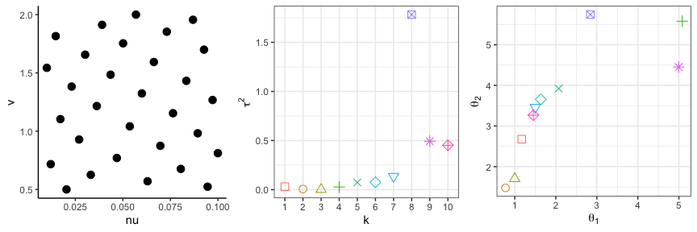

Mesh-clustered Gaussian Process (mcGP) emulator for partial differential
equation systems (Reproducibility)
================
January 15, 2024

This instruction aims to reproduce the results in the paper
“*Mesh-clustered Gaussian Process emulator for partial differential
equation systems*”.

The following results are reproduced in this file

- Section 5.1: Figures 4, 5, and 7
- Section 5.2: Figures 8 and 10, and Table 2
- Section 5.3: Figure 12 and Table 3

Note that here some of the figures are not demonstrated here because
they are plotted by MATLAB with specific tools, such as Figure 15, where
Partial Differential Equation Toolbox needs to be installed on MATLAB.
This file only demonstrates the results that can be reproduced via the
free software `R`.

##### Step 0.1: load functions and packages

``` r
library(R.matlab)
library(scoringRules)
library(gridExtra)
library(ggplot2)
library(plgp)
library(CholWishart)
library(parallel)
library(doParallel)
library(foreach)
source("mcGP.R")                # mcGP
source("GP.R")                  # iGP and uGP for comparison 
source("pcaGP.R")               # PCA GP for comparison 
source("matern.kernel.R")       # matern kernel
```

##### Step 0.2: setting

``` r
eps <- sqrt(.Machine$double.eps) #small nugget for numeric stability
```

## Section 5.1:

##### Section 5.1: Reproducing Figure 4

The FEM data for the Poisson’s equation is saved as `.mat` files so we
will need `R.matlab` package to read the data. We first demonstrate our
approach using the FEM data with mesh size 0.2. Figure 4 shows the
variational distribution of $q(Z)$.

``` r
# read input, output data, and the mesh data
matdata <- readMat("matlab/poisson_train/meshsize200/poi1.mat")
X <- matrix(0,ncol=1,nrow=5)
Y <- matrix(0,ncol=5,nrow=length(matdata$u))

for(i in 1L:5){
  matdata <- readMat(paste0("matlab/poisson_train/meshsize200/poi", i,".mat"))
  Y[,i] <- matdata$u         # output data (numeric solutions)
  X[i,1] <- matdata$a[1,1]   # input data
}
S <- t(matdata$nodes)        # mesh locations

X.test <- as.matrix(-0.25,ncol=1)

# perform mcGP 
mcGP.fit <- mcGP(X, Y, S, parallel = TRUE) 
mcGP.pred <- predict.mcGP(mcGP.fit, Y=Y, xnew=X.test, sig2.fg=TRUE)

# plot variational distribution qZ 
Z <- apply(mcGP.fit$q_Z,1,which.max)
select.idx <- which(apply(mcGP.fit$q_Z, 2, max) > 0.001)

gg.out <- vector("list", length(select.idx))
j <- 0
for(i in select.idx){
  j <- j + 1
  qZ.df <- data.frame(cbind(S,qZ=mcGP.fit$q_Z[,i]))
  colnames(qZ.df)[1:2] <- c("V2", "V3")
  gg.out[[j]] <- ggplot(qZ.df, aes(x=V2, y=V3, alpha=qZ)) + 
    geom_point(color="#69b3a2",size=2.5)+xlab(paste0("(",letters[j],") k=",i))+ylab("")+
    scale_alpha_continuous(breaks = c(0.2,0.4,0.6,0.8)) +
    theme(legend.position = "none",
          panel.grid.major = element_blank(), panel.grid.minor = element_blank(),
          panel.background = element_blank(), axis.line = element_blank(), 
          axis.ticks = element_blank(), axis.text = element_blank(),
          axis.title=element_text(size=20))
  
}
grid.arrange(gg.out[[1]], gg.out[[2]], gg.out[[3]], gg.out[[4]], ncol = 4)
```


##### Section 5.1: Reproducing Figure 5

Now we produce Figure 5, which shows the hyperparameter estimates
$\hat{\tau}_k$ and $\hat{\theta}_k$.

``` r
# plot hyperparameters in each group
tau2 <- data.frame(tau2=mcGP.fit$tau2[select.idx],k=as.factor(select.idx))
g1 <- ggplot(tau2, aes(x=k, y=tau2[select.idx], color=k, shape=k)) + 
  geom_point(size=3)+theme_bw()+
  scale_shape_manual(values=seq(0,length(select.idx)))+ylab(expression(tau^2)) + theme(legend.position = "none")
theta.hat <- data.frame(theta=mcGP.fit$theta[select.idx],k=as.factor(select.idx))
g2 <- ggplot(theta.hat, aes(x=k, y=theta, color=k, shape=k)) + 
  geom_point(size=3)+theme_bw()+
  scale_shape_manual(values=seq(0,length(select.idx)))+ theme(legend.position = "none")+
  ylab(expression(theta))
grid.arrange(g1, g2, ncol = 2)
```


##### Section 5.1: Reproducing Figure 7

Compare with other methods with mesh sizes 0.4, 0.2, 0.1, 0.05, and
0.025. Figure 7 shows the performance in terms of prediction accuracy
and computational cost. It will take a little bit time to run this
chunk.

``` r
# set up
meshsize.vt <- c(0.4,0.2,0.1,0.05,0.025) # try five different mesh sizes
node.size <- rep(0, length(meshsize.vt))

FitTime <- PredTime <- RMSE <- Score <- matrix(0, ncol=5, nrow=length(meshsize.vt))
colnames(FitTime) <- colnames(PredTime) <- colnames(RMSE) <- colnames(Score) <- c("mcGP", "uGP", "iGP", "pcaGP", "FEM")

for(ii in 1:length(meshsize.vt)){
  meshsize <- meshsize.vt[ii]
  matdata <- readMat(paste0("matlab/poisson_train/meshsize", meshsize*1000 ,"/poi1.mat"))
  
  # read training data
  Y <- matrix(0,ncol=5,nrow=length(matdata$u))
  X <- matrix(0,ncol=1,nrow=5)
  for(i in 1L:5){
    matdata <- readMat(paste0("matlab/poisson_train/meshsize", meshsize*1000 ,"/poi", i,".mat"))
    Y[,i] <- matdata$u
    X[i,1] <- matdata$a[1,1]
  }
  S <- t(matdata$nodes)
  node.size[ii] <- nrow(S)
  
  # read test data
  Y.test <- matrix(0,ncol=201,nrow=length(matdata$u))
  X.test <- matrix(0,ncol=1,nrow=201)
  FEM.time <- rep(0, 201)
  for(i in 1:201){
    matdata <- readMat(paste0("matlab/poisson_test/meshsize", meshsize*1000 ,"/poi_test", i,".mat"))
    Y.test[,i] <- matdata$u
    X.test[i,1] <- matdata$a[1,1]
    FEM.time[i] <- matdata$cpu.time
  }
  
  PredTime[ii,"FEM"] <- mean(FEM.time)
  
  # perform mcGP 
  mcGP.fit <- mcGP(X, Y, S, parallel = TRUE) 
  mcGP.pred <- predict.mcGP(mcGP.fit, Y=Y, xnew=X.test, sig2.fg=TRUE)
  FitTime[ii,"mcGP"] <- mcGP.fit$time.elapsed[3]
  PredTime[ii,"mcGP"] <- mcGP.pred$time.elapsed[3]/nrow(X.test)
  
  # perform uGP
  uGP.fit <- uGP(X, Y, S)
  uGP.pred <- predict.uGP(uGP.fit, Y=Y, xnew=X.test, sig2.fg=TRUE)
  FitTime[ii,"uGP"] <- uGP.fit$time.elapsed[3]
  PredTime[ii,"uGP"] <- uGP.pred$time.elapsed[3]/nrow(X.test)
  
  # perform iGP 
  iGP.fit <- iGP(X, Y, S, parallel = TRUE) 
  iGP.pred <- predict.iGP(iGP.fit, Y=Y, xnew=X.test, sig2.fg=TRUE)
  FitTime[ii,"iGP"]<- iGP.fit$time.elapsed[3]
  PredTime[ii,"iGP"] <- iGP.pred$time.elapsed[3]/nrow(X.test)
  
  # perform pcaGP
  pcaGP.fit <- pcaGP(X, Y) 
  pcaGP.pred <- predict.pcaGP(pcaGP.fit, Y=Y, xnew=X.test, sig2.fg=TRUE)
  FitTime[ii,"pcaGP"]<- pcaGP.fit$time.elapsed[3]
  PredTime[ii,"pcaGP"] <- pcaGP.pred$time.elapsed[3]/nrow(X.test) 
 
  for(i in 1:nrow(X.test)){
    Score[ii,"mcGP"] <- Score[ii,"mcGP"] + mean(crps(y=Y.test[,i], family = "mixnorm", 
                                                     m = mcGP.pred$mean.array[,i,], 
                                                     s = sqrt(mcGP.pred$sig2.array[,i,]), w=mcGP.fit$q_Z))
    Score[ii,"uGP"] <- Score[ii,"uGP"] + mean(crps(y = Y.test[,i], family = "normal", 
                                                   mean = uGP.pred$mean[,i], 
                                                   sd = sqrt(uGP.pred$sig2[,i])))
    Score[ii,"iGP"] <- Score[ii,"iGP"] + mean(crps(y = Y.test[,i], family = "normal", 
                                                   mean = iGP.pred$mean[,i], 
                                                   sd = sqrt(iGP.pred$sig2[,i])))
    Score[ii,"pcaGP"] <- Score[ii,"pcaGP"] + mean(crps(y = Y.test[,i], family = "normal", 
                                                   mean = pcaGP.pred$mean[,i], 
                                                   sd = pmax(eps, sqrt(pcaGP.pred$sig2[,i]))))
    RMSE[ii,"mcGP"] <- RMSE[ii,"mcGP"] + mean((Y.test[,i] - mcGP.pred$mean[,i])^2)
    RMSE[ii,"uGP"] <- RMSE[ii,"uGP"] + mean((Y.test[,i] - uGP.pred$mean[,i])^2)
    RMSE[ii,"iGP"] <- RMSE[ii,"iGP"] + mean((Y.test[,i] - iGP.pred$mean[,i])^2)
    RMSE[ii,"pcaGP"] <- RMSE[ii,"pcaGP"] + mean((Y.test[,i] - pcaGP.pred$mean[,i])^2)
  }
  
  Score[ii,] <- Score[ii,]/nrow(X.test) 
  RMSE[ii,] <- sqrt(RMSE[ii,]/nrow(X.test))
}

# RMSE
RMSE.df <- stack(data.frame(RMSE[,1:4]))
RMSE.df <- cbind(rep(node.size, 4), RMSE.df)
colnames(RMSE.df) <- c("meshsize", "RMSE", "method")
g1 <- ggplot(RMSE.df, aes(x=log(meshsize), y=log(RMSE), shape=method, color=method)) +
  scale_color_manual(values=c("#F8766D", "#00BA38", "#619CFF", "#C77CFF"))+
  geom_point(size=3)+geom_line()+theme_bw()+ theme(legend.position="none") + xlab("log(N)")
g1 <- g1+scale_shape_manual(values=c(0:2,4))

# Score
Score.df <- stack(data.frame(Score[,1:4]))
Score.df <- cbind(rep(node.size, 4), Score.df)
colnames(Score.df) <- c("meshsize", "CRPS", "method")
g2 <- ggplot(Score.df, aes(x=log(meshsize), y=log(CRPS), shape=method, color=method)) +
  scale_color_manual(values=c("#F8766D", "#00BA38", "#619CFF", "#C77CFF"))+
  geom_point(size=3)+geom_line()+theme_bw()+ theme(legend.position="none") + xlab("log(N)")
g2 <- g2+scale_shape_manual(values=c(0:2,4))

# Fitting time
FitTime.df <- stack(data.frame(FitTime[,1:4]))
FitTime.df <- cbind(rep(node.size, 4), FitTime.df)
colnames(FitTime.df) <- c("meshsize", "time", "method")
g3 <- ggplot(FitTime.df, aes(x=meshsize/1000, y=time, shape=method, color=method)) +
  scale_color_manual(values=c("#F8766D", "#00BA38", "#619CFF", "#C77CFF"))+
  geom_point(size=3)+geom_line()+theme_bw()+ theme(legend.position="none") + xlab("N (X 1,000)")
g3 <- g3+scale_shape_manual(values=c(0:2,4)) + ylab("fitting time (sec.)")

# Prediction time
PredTime.df <- stack(data.frame(PredTime))
PredTime.df <- cbind(rep(node.size, 5), PredTime.df)
colnames(PredTime.df) <- c("meshsize", "time", "method")
g4 <- ggplot(PredTime.df, aes(x=meshsize/1000, y=time, shape=method, color=method)) +
  geom_point(size=3)+geom_line(aes(linetype=method))+theme_bw()+ theme(legend.position="none") + xlab("N (X 1,000)")
g4 <- g4+scale_linetype_manual(values=c("solid", "solid", "solid", "solid", "dashed"))+
  scale_color_manual(values=c("#F8766D", "#00BA38", "#619CFF", "#C77CFF","#000000"))+
  scale_shape_manual(values=c(0:2,4,19)) + ylab("prediction time per run (sec.)")

grid.arrange(g1, g2, g3, g4, ncol = 4)
```


## Section 5.2

##### Section 5.2: Reproducing Table 2

This section demonstrates the example of laminar flow past a cylinder.
This FEM data is again saved as `.mat` files. Table 2 shows the
performance in terms of prediction accuracy and computational cost.

``` r
# read data: run FEM via matlab
# input data
X <- readMat("matlab/cylinder_train/X.train.mat")$X.train
X.test <- readMat("matlab/cylinder_test/X.test.mat")$X.test
# mesh locations
S <- read.table("matlab/cylinder_train/velocity_y_component1.msh",
                skip=5,nrow=3778)[,2:3]
# output data
Y <- matrix(0,ncol=nrow(X),nrow=nrow(S))
for(i in 1L:nrow(X)){
  Y[,i] <- read.table(paste0("matlab/cylinder_train/velocity_y_component", i,".msh"),
                      skip=5622,nrow=3778)[,2]
}

Y.test <- matrix(0,ncol=nrow(X.test),nrow=nrow(S))
for(i in 1L:nrow(X.test)){
  Y.test[,i] <- read.table(paste0("matlab/cylinder_test/velocity_y_component", i,".msh"),
                        skip=5622,nrow=3778)[,2]
}
# FEM computational cost
FEM.time <- readMat(paste0("matlab/cylinder_test/cpu_time.mat"))$cpu.time/nrow(X.test)

# Comparison
FitTime <- PredTime <- RMSE <- Score <- rep(0, 5)
names(FitTime) <- names(PredTime) <- names(RMSE) <- names(Score) <- c("mcGP", "uGP", "iGP", "pcaGP", "FEM")
PredTime["FEM"] <- FEM.time

# perform mcGP 
mcGP.fit <- mcGP(X, Y, S, parallel = TRUE) 
mcGP.pred <- predict.mcGP(mcGP.fit, Y=Y, xnew=X.test, sig2.fg=TRUE)
FitTime["mcGP"] <- mcGP.fit$time.elapsed[3]
PredTime["mcGP"] <- mcGP.pred$time.elapsed[3]/nrow(X.test)

# perform uGP
uGP.fit <- uGP(X, Y, S)
uGP.pred <- predict.uGP(uGP.fit, Y=Y, xnew=X.test, sig2.fg=TRUE)
FitTime["uGP"] <- uGP.fit$time.elapsed[3]
PredTime["uGP"] <- uGP.pred$time.elapsed[3]/nrow(X.test)

# perform iGP 
iGP.fit <- iGP(X, Y, S, parallel = TRUE) 
iGP.pred <- predict.iGP(iGP.fit, Y=Y, xnew=X.test, sig2.fg=TRUE)
FitTime["iGP"]<- iGP.fit$time.elapsed[3]
PredTime["iGP"] <- iGP.pred$time.elapsed[3]/nrow(X.test)

# perform pcaGP
pcaGP.fit <- pcaGP(X, Y) 
pcaGP.pred <- predict.pcaGP(pcaGP.fit, Y=Y, xnew=X.test, sig2.fg=TRUE)
FitTime["pcaGP"]<- pcaGP.fit$time.elapsed[3]
PredTime["pcaGP"] <- pcaGP.pred$time.elapsed[3]/nrow(X.test) 

# Evaluate the performance
for(i in 1:nrow(X.test)){
  Score["mcGP"] <- Score["mcGP"] + mean(crps(y=Y.test[,i], family = "mixnorm", 
                                                   m = mcGP.pred$mean.array[,i,], 
                                                   s = sqrt(mcGP.pred$sig2.array[,i,]), w=mcGP.fit$q_Z))
  Score["uGP"] <- Score["uGP"] + mean(crps(y = Y.test[,i], family = "normal", 
                                                 mean = uGP.pred$mean[,i], 
                                                 sd = sqrt(uGP.pred$sig2[,i])))
  Score["iGP"] <- Score["iGP"] + mean(crps(y = Y.test[,i], family = "normal", 
                                                 mean = iGP.pred$mean[,i], 
                                                 sd = sqrt(iGP.pred$sig2[,i])))
  Score["pcaGP"] <- Score["pcaGP"] + mean(crps(y = Y.test[,i], family = "normal", 
                                                     mean = pcaGP.pred$mean[,i], 
                                                     sd = pmax(eps, sqrt(pcaGP.pred$sig2[,i]))))
  RMSE["mcGP"] <- RMSE["mcGP"] + mean((Y.test[,i] - mcGP.pred$mean[,i])^2)
  RMSE["uGP"] <- RMSE["uGP"] + mean((Y.test[,i] - uGP.pred$mean[,i])^2)
  RMSE["iGP"] <- RMSE["iGP"] + mean((Y.test[,i] - iGP.pred$mean[,i])^2)
  RMSE["pcaGP"] <- RMSE["pcaGP"] + mean((Y.test[,i] - pcaGP.pred$mean[,i])^2)
}

RMSE <- sqrt(RMSE/nrow(X.test))
Score <- Score/nrow(X.test)

out <- rbind(format(RMSE*10000, digits=4),
             format(Score*10000, digits=4),
             format(FitTime, digits=4),
             format(PredTime*1000, digits=4))
colnames(out) <- c("mcGP", "uGP", "iGP", "pcaGP", "FEM")
rownames(out) <- c("RMSE", "CRPS", "fitting time", "prediction time per run")
knitr::kable(out)
```

|                         | mcGP   | uGP   | iGP    | pcaGP  | FEM     |
|:------------------------|:-------|:------|:-------|:-------|:--------|
| RMSE                    | 8.742  | 9.064 | 15.434 | 24.880 | 0.000   |
| CRPS                    | 2.276  | 2.410 | 5.321  | 15.183 | 0.000   |
| fitting time            | 36.876 | 8.485 | 8.106  | 0.058  | 0.000   |
| prediction time per run | 2.42   | 0.10  | 14.95  | 0.06   | 1266.33 |

##### Section 5.2: Reproducing Figure 8

Figure 8 shows the design points and the hyperparameter estimates
$\hat{\tau}_k$ and $\hat{\boldsymbol{\theta}}_k$.

``` r
doe.df <- data.frame(t(t(X) * c(0.09,1.5) + c(0.01,0.5)))
colnames(doe.df) <- c("nu", "v")
# design points
g1 <- ggplot(doe.df, aes(x=nu, y=v)) + geom_point(size=3)+theme_classic()
tau2 <- data.frame(tau2=mcGP.fit$tau2,k=as.factor(1:10))
# tau2 hat
g2 <- ggplot(tau2, aes(x=k, y=tau2, color=k, shape=k)) + 
  geom_point(size=3)+theme_bw()+
  scale_shape_manual(values=seq(0,10))+ylab(expression(tau^2)) + theme(legend.position = "none")
theta.hat <- data.frame(theta1=mcGP.fit$theta[,1],theta2=mcGP.fit$theta[,2],k=as.factor(1:10))
# theta hat
g3 <- ggplot(theta.hat, aes(x=theta1, y=theta2, color=k, shape=k)) + 
  geom_point(size=3)+theme_bw()+
  scale_shape_manual(values=seq(0,10))+ theme(legend.position = "none")+
  xlab(expression(theta[1]))+ylab(expression(theta[2]))

grid.arrange(g1, g2, g3, ncol = 3)
```



##### Section 5.2: Reproducing Figure 10

Figure 10 shows the variational distribution of $q(Z)$.

``` r
select.idx <- which(apply(mcGP.fit$q_Z, 2, max) > 0.1)
gg.out <- vector("list", length(select.idx))
j <- 0
for(i in select.idx){
  j <- j + 1
  gg.out[[j]] <- ggplot(cbind(S,qZ=mcGP.fit$q_Z[,i]), aes(x=V2, y=V3, alpha=qZ)) + 
    geom_point(color="#69b3a2")+xlab(paste0("(",letters[j],") k=",i))+ylab("")+
    scale_alpha_continuous(breaks = c(0.2,0.4,0.6,0.8)) +
    theme(legend.position = "none",
          panel.grid.major = element_blank(), panel.grid.minor = element_blank(),
          panel.background = element_blank(), axis.line = element_blank(), 
          axis.ticks = element_blank(), axis.text = element_blank(),
          axis.title=element_text(size=20))
  
}
grid.arrange(gg.out[[1]], gg.out[[2]], gg.out[[3]], gg.out[[4]], 
             gg.out[[5]], gg.out[[6]], gg.out[[7]], gg.out[[8]], ncol = 4)
```


## Section 5.3

##### Section 5.3: Reproducing Table 3

This section demonstrates the example of thermal stress analysis of jet
engine turbine blade. This FEM data is again saved as `.mat` files.
Table 3 shows the performance in terms of prediction accuracy and
computational cost.

``` r
# read data: run FEM via matlab
# input data
X <- readMat("matlab/blade_train/X.train.mat")$X.train
X.test <- readMat("matlab/blade_test/X.test.mat")$X.test

# mesh locations
S <- t(readMat("matlab/blade_train/blade1.mat")$nodes)

# output data
Y <- matrix(0,ncol=nrow(X),nrow=nrow(S))
for(i in 1L:nrow(X)){
  matdata <- readMat(paste0("matlab/blade_train/blade", i,".mat"))
  Y[,i] <- matdata$stress
}

Y.test <- matrix(0,ncol=nrow(X.test),nrow=nrow(S))
FEM.time <- rep(0, nrow(X.test))
for(i in 1:nrow(X.test)){
  matdata <- readMat(paste0("matlab/blade_test/blade_test", i,".mat"))
  Y.test[,i] <- matdata$stress
  FEM.time[i] <- matdata$cpu.time
}

# Comparison
FitTime <- PredTime <- RMSE <- Score <- rep(0, 5)
names(FitTime) <- names(PredTime) <- names(RMSE) <- names(Score) <- c("mcGP", "uGP", "iGP", "pcaGP", "FEM")
PredTime["FEM"] <- mean(FEM.time)

# perform mcGP 
mcGP.fit <- mcGP(X, Y, S, parallel = TRUE) 
mcGP.pred <- predict.mcGP(mcGP.fit, Y=Y, xnew=X.test, sig2.fg=TRUE)
FitTime["mcGP"] <- mcGP.fit$time.elapsed[3]
PredTime["mcGP"] <- mcGP.pred$time.elapsed[3]/nrow(X.test)

# perform uGP
uGP.fit <- uGP(X, Y, S) 
uGP.pred <- predict.uGP(uGP.fit, Y=Y, xnew=X.test, sig2.fg=TRUE)
FitTime["uGP"] <- uGP.fit$time.elapsed[3]
PredTime["uGP"] <- uGP.pred$time.elapsed[3]/nrow(X.test)

# perform iGP 
iGP.fit <- iGP(X, Y, S, parallel = TRUE) 
iGP.pred <- predict.iGP(iGP.fit, Y=Y, xnew=X.test, sig2.fg=TRUE)
FitTime["iGP"]<- iGP.fit$time.elapsed[3]
PredTime["iGP"] <- iGP.pred$time.elapsed[3]/nrow(X.test)

# perform pcaGP
pcaGP.fit <- pcaGP(X, Y) 
pcaGP.pred <- predict.pcaGP(pcaGP.fit, Y=Y, xnew=X.test, sig2.fg=TRUE)
FitTime["pcaGP"]<- pcaGP.fit$time.elapsed[3]
PredTime["pcaGP"] <- pcaGP.pred$time.elapsed[3]/nrow(X.test) 

for(i in 1:nrow(X.test)){
  Score["mcGP"] <- Score["mcGP"] + mean(crps(y=Y.test[,i], family = "mixnorm", 
                                             m = mcGP.pred$mean.array[,i,], 
                                             s = sqrt(mcGP.pred$sig2.array[,i,]), w=mcGP.fit$q_Z))
  Score["uGP"] <- Score["uGP"] + mean(crps(y = Y.test[,i], family = "normal", 
                                           mean = uGP.pred$mean[,i], 
                                           sd = sqrt(uGP.pred$sig2[,i])))
  Score["iGP"] <- Score["iGP"] + mean(crps(y = Y.test[,i], family = "normal", 
                                           mean = iGP.pred$mean[,i], 
                                           sd = sqrt(iGP.pred$sig2[,i])))
  Score["pcaGP"] <- Score["pcaGP"] + mean(crps(y = Y.test[,i], family = "normal", 
                                               mean = pcaGP.pred$mean[,i], 
                                               sd = pmax(eps, sqrt(pcaGP.pred$sig2[,i]))))
  RMSE["mcGP"] <- RMSE["mcGP"] + mean((Y.test[,i] - mcGP.pred$mean[,i])^2)
  RMSE["uGP"] <- RMSE["uGP"] + mean((Y.test[,i] - uGP.pred$mean[,i])^2)
  RMSE["iGP"] <- RMSE["iGP"] + mean((Y.test[,i] - iGP.pred$mean[,i])^2)
  RMSE["pcaGP"] <- RMSE["pcaGP"] + mean((Y.test[,i] - pcaGP.pred$mean[,i])^2)
}
RMSE <- sqrt(RMSE/nrow(X.test))
Score <- Score/nrow(X.test)

out <- rbind(format(RMSE*10, digits=4),
             format(Score*10, digits=4),
             format(FitTime, digits=4),
             format(PredTime*1000, digits=4))
colnames(out) <- c("mcGP", "uGP", "iGP", "pcaGP", "FEM")
rownames(out) <- c("RMSE", "CRPS", "fitting time", "prediction time per run")
knitr::kable(out)
```

|                         | mcGP    | uGP     | iGP    | pcaGP  | FEM     |
|:------------------------|:--------|:--------|:-------|:-------|:--------|
| RMSE                    | 9.800   | 9.823   | 11.096 | 13.986 | 0.000   |
| CRPS                    | 3.204   | 3.236   | 3.616  | 6.753  | 0.000   |
| fitting time            | 122.476 | 114.735 | 53.689 | 0.101  | 0.000   |
| prediction time per run | 15.27   | 0.55    | 82.76  | 0.40   | 4020.70 |

##### Section 5.3: Reproducing Figure 12

Figure 10 shows the design points and the hyperparameter estimates
$\hat{\tau}_k$ and $\hat{\boldsymbol{\theta}}_k$.

``` r
doe.df <- data.frame(X)
colnames(doe.df) <- c("pressure", "suction")
# design points
g1 <- ggplot(doe.df, aes(x=pressure, y=suction)) + geom_point(size=3)+theme_classic()
tau2 <- data.frame(tau2=mcGP.fit$tau2,k=as.factor(1:10))

# tau2 hat
g2 <- ggplot(tau2, aes(x=k, y=tau2, color=k, shape=k)) + 
  geom_point(size=3)+theme_bw()+
  scale_shape_manual(values=seq(0,10))+ylab(expression(tau^2)) + theme(legend.position = "none")
theta.hat <- data.frame(theta1=mcGP.fit$theta[,1],theta2=mcGP.fit$theta[,2],k=as.factor(1:10))

# theta hat
g3 <- ggplot(theta.hat, aes(x=theta1, y=theta2, color=k, shape=k)) + 
  geom_point(size=3)+theme_bw()+
  scale_shape_manual(values=seq(0,10))+ theme(legend.position = "none")+
  xlab(expression(theta[1]))+ylab(expression(theta[2]))

grid.arrange(g1, g2, g3, ncol = 3)
```


